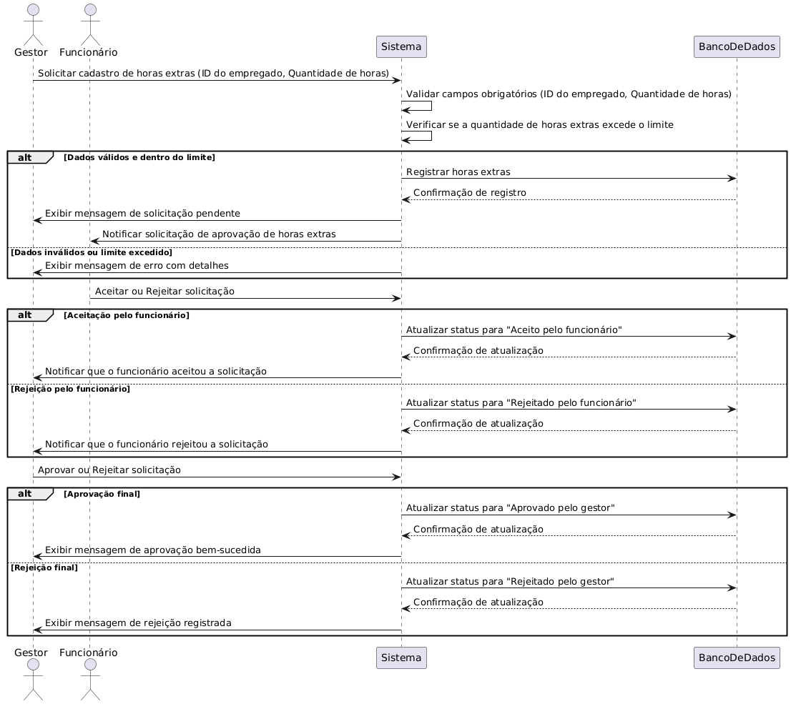

## RF03 - Cadastro de horas extras

**COMO** gestor de projetos
**QUERO** registrar e aprovar as horas extras realizadas pelos empregados
**PARA** garantir a contabilização correta das horas extras dos empregados.

---

## **Prioridade**
Média

---

## **Requisitos Relacionados**
-[RF004](REQ004.md)

---

## **Dados e Validações**
1. **Dados Necessários**
   - **ID do empregado**
     - Tipo: Number
     - Validação: Deve ser único e não vazio.
   - **Quantidade de horas**
     - Tipo: Number
     - Validação: Deve ser um número positivo e não vazio. 

2. **Validações adicionais**
   - O sistema deve verificar se a carga horária de horas extras foi excedida.

---

## **Critérios de Aceitação**
1. **Cadastro bem-sucedido:**
   - Quando todos os campos obrigatórios são preenchidos corretamente, o leito deve ser cadastrado e associado à ala escolhida. 

2. **Confirmação de cadastro:**
   - O sistema vai encaminhar como solicitação, esperando o aceite de ambas as partes para homologar.

---

## **Diagramas**
- **Diagrama de sequência**
