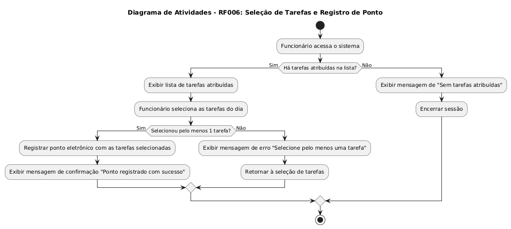

## RF006 - Permitir que o funcionário selecione suas tarefas do dia e registre o ponto

**COMO** funcionário ou prestador de serviço da empresa 
**QUERO** escolher quais atividades, dentro da minhas lista de atividades atribuidas, serão realizadas no dia ao registrar meu ponto eletrônico
**PARA** que eu possa ter um controle das atividades que serão feitas no dia e para facilitar o acompanhamento do meu progresso

---

## **Prioridade** 
Alta

---

## **Requisitos relacionados** 
-[RF007](REQ007.md)

---

## **Dados e Validações**
1. **Dados Necessários** 
   - **Tarefas a serem executadas**  
     - Tipo: Tarefa  
     - Validação: O funcionário deve selecionar as tarefas do dia.  
   

2. **Validações Adicionais**
   - O funcionário deve selecionar pelo menos 1 tarefa para realizar o ponto eletrônico do dia.   

---

## **Critérios de Aceitação**
1. **Tarefas adicionadas com sucesso ao dia de trabalho:**  
   - O funcionário atribui suas tarefas do dia e realiza seu ponto.
2. **Validação das tarefas do dia:**  
   - Caso o funcionário não selecione nenhuma tarefa o sistema informará o erro e não permitirá o registro do ponto eletrônico.

---

## **Diagramas**
- **Diagrama de Atividades**

