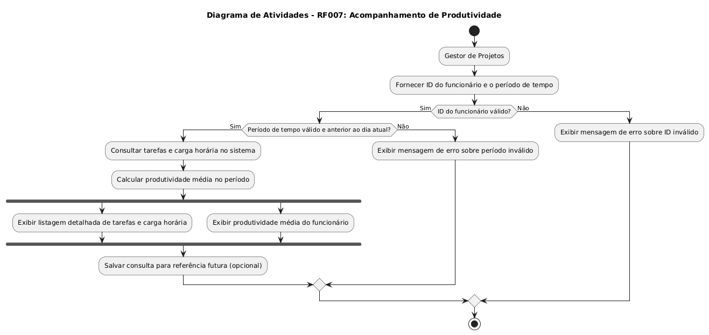

## RF07 - Acompanhamento de produtividade

**COMO** gestor de projetos
**QUERO** visualizar a produtividade de um funcionário em um certo périodo
**PARA** que eu possa consultar, quando preciso, as tarefas e carga horária feitas

---

## **Prioridade**
Média

---

## **Requisitos Relacionados**
-[RF006](REQ006.md)

---

## **Dados e Validações**
1. **Dados Necessários**
   - **ID do funcionário**
     - Tipo: Number
     - Validação: Deve ser único e não vazio
   -  **Período de tempo** 
      -  Tipo: Data
      -  Validação: Deve ser uma data valida e não vazia.

2. **Validações Adicionais**
    - O sistema deve verificar se o período de tempo se referencia uma data anterior ao dia atual.

---

## **Critérios de Aceitação**
1. **Listagem de tarefas e carga horaria:**
    - Permitir detalhamento das tarefas e carga horaria por dia.
  
2. **Produtividade:**
    - O sistema irá exibir a produdividade média com base no período solicitado.

---

## **Diagramas**
    - **Diagrama de atividade**
